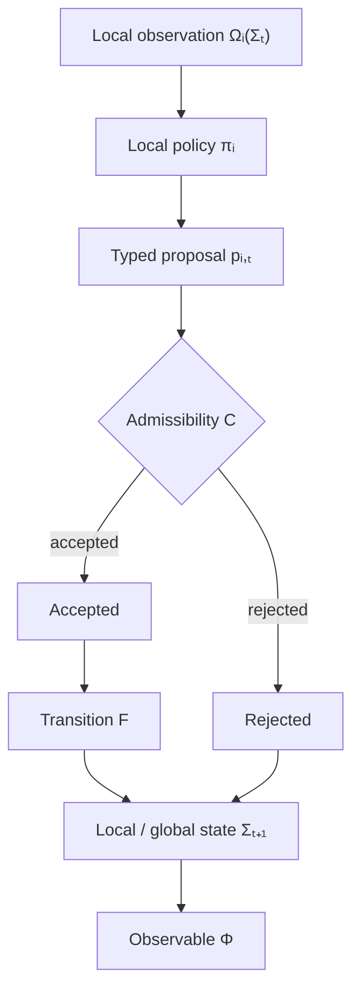

<div align="center">


# Starlings

**Decentralized intelligence through controlled emergence.**

[](https://ziglang.org/)
[](#architecture)
[](#deterministic-runtime)
[](#research-status)

</div>

---

Starlings is a coordination substrate for **decentralized artificial intelligence through controlled emergence**.

Instead of treating intelligence as one central model, planner, or orchestrator, Starlings treats a system as a population of local operators. Each operator sees only the context available to it, contributes what it can establish, and coordinates through a small typed protocol.

An operator does **not** have to be an LLM. It can be anything capable of supplying useful state to the collective:

- a small local language or vision model;
- a deterministic algorithm or state machine;
- a sensor or sensor-fusion process;
- a physics, geometry, optimization, or planning solver;
- a database query, retrieval system, or external tool;
- a robot, service, human reviewer, or other bounded decision process.

What matters is not the implementation behind an operator. What matters is the contextual information it can contribute: **variables, invariants, observations, estimates, constraints, hypotheses, evidence, or admissible actions**.

Starlings coordinates those contributions without requiring a central component to encode the complete workflow. Local operators expose partial knowledge; causal evidence changes what becomes possible next; runtime constraints bound what is allowed; and the resulting global trajectory emerges from those interactions.

> **The goal is controlled emergence:** global behavior that is not centrally scripted, but is still constrained, attributable, reproducible where required, and measurable under faults and limited resources.

This makes the research problem broader than multi-agent LLM orchestration. The same coordination machinery can connect small local models with non-ML operators and physical or computational systems, allowing the collective to reason over context that no single operator possesses.

The protocol and formal substrate live here. Executable stress tests, application witnesses, and falsification experiments live in [`beaglabs/starling-experiments`](https://github.com/beaglabs/starling-experiments).

## Core capabilities

- **Heterogeneous local operators** — coordinate LLMs, deterministic code, sensors, solvers, tools, humans, and other bounded processes through the same protocol boundary.
- **Contextual variable and invariant exchange** — operators can contribute observations, estimates, constraints, invariants, hypotheses, evidence, and actions without sharing a common internal implementation.
- **Controlled emergence** — the runtime constrains admissibility and provenance while leaving the global workflow to arise from local state and local eligibility.
- **No central semantic schedule** — the coordination substrate does not require a single planner to encode the complete action sequence.
- **Typed coordination grammar** — `OBSERVE`, `QUERY`, `CLAIM`, `EVIDENCE`, `PROPOSE`, `ACCEPT`, `REJECT`, `CHALLENGE`, `RETRACT`, and `DELEGATE`.
- **Deterministic execution where required** — seeded entropy, logical clocks, bounded queues, explicit routing failures, and replay-friendly traces.
- **Content-addressed causal provenance** — BLAKE3 identities, canonical encodings, parent closure, and Merkle-DAG ancestry make contributions attributable and replayable.
- **Pluggable local policies** — deterministic rules, parameterized policies, learned models, solvers, or external adapters can participate without changing the protocol core.

## Architecture

Starlings separates **what an operator knows or can do** from **how the collective coordinates it**.



Operators own local observations and local decisions. The coordination substrate owns admissibility, causal provenance, accounting, and replay.

A sensor can publish a measurement, a solver can establish an invariant, a local model can propose a hypothesis, and a deterministic tool can derive a new variable. None of them needs the full global plan. Their contributions change the state visible to other operators, which changes what becomes locally eligible next.

The workflow is therefore an **outcome of coordinated local state transitions**, not a centrally authored pipeline.

## SDK-first populations

The supported product surface is the Zig SDK plus declarative YAML populations.
`Population` loads an Emergence Pack and `Agent` binds its native, Python,
subprocess, and shared-model implementations. Applications own lifecycle and
inject observations explicitly:

```zig
var population = try starlings.Population.load(io, gpa, arena, "population");
var agent = try starlings.Agent.init(
    io,
    gpa,
    arena,
    &population,
    42,
    .{ .models = model_providers, .native = native_bindings },
);
defer agent.deinit();

_ = try agent.observe(.{
    .name = "source.text",
    .status = .observed,
    .value = .{ .text = "..." },
});

while (try agent.step() == .progress) {}
```

Operators may carry semantic roles—`model`, `collector`, `tool`,
`transform`, `validator`, or `actor`—without changing the common
requires/provides contract. Multiple logical model operators may share one
host-injected model provider, so operator diversity does not require duplicate
resident weights.

See [SDK-First Populations](docs/SDK_POPULATIONS.md).

## Formal model

The canonical population is:

```text
P = (A, G, X, M, F, Π, C, Φ, J)
```

| Symbol | Meaning |
| --- | --- |
| `A` | operator population |
| `G` | communication / neighborhood graph |
| `X` | local state |
| `M` | typed coordination actions / messages |
| `F` | deterministic state-transition semantics |
| `Π` | local policy family |
| `C` | admissibility / control constraints |
| `Φ` | global observable / terminal evaluation |
| `J` | cost / measurement vector |

The operational model also makes explicit `Ω` (local observation), `α` (arbitration), and `H` (content identity).

**[Read Formal Starlings Model v0.1](docs/FORMAL_MODEL.md)**

The specification defines heterogeneous populations, local observation boundaries, typed proposals, synchronous/queue/event arbitration, global transition semantics, workflow emergence, deadlock, fault assumptions, theorem status, empirical laws, and the planned Byzantine robustness extension.

## Deterministic runtime

The core runtime uses bounded deterministic state transitions.

A message contains:

```text
sender
recipient
kind
payload
causal_ref
logical_clock
```

The runtime dequeues a message, resolves the recipient, advances logical time, appends the trace event, applies the local transition, and enqueues any emitted response.

Seeded entropy is exposed explicitly for experiments without hard-wiring one scheduler into the foundation.

### Durable replay

The SDK can persist the canonical runtime event chain under
`.starlings/runs/<run-id>/` and reconstruct a replay-only runner after process
restart. Durable replay validates the configuration snapshot, event hash chain,
operator/activation ordering, and scheduler state without invoking operator
implementations.

Replay is an SDK capability rather than a command-line product surface. See
[Durable Replay v1](docs/DURABLE_REPLAY.md) for the storage format, crash-tail
semantics, replay envelope, and acceptance path.

## Content-addressed provenance

Starlings treats provenance as part of the protocol, not a logging afterthought.

Canonical causal events are encoded as:

```text
version:u8
|| event_kind:u8
|| payload:u64 little-endian
|| parent_count:u8
|| parent_content_ids[0..parent_count]
```

and identified by `BLAKE3(canonical_event_encoding)`.

The current implementation enforces deduplication, parent closure, reconstructable ancestry, explicit fork/merge history, and exact replica divergence accounting.

## Existing empirical laws

The current evidence supports several compact relationships with explicitly limited claim scope.

### Sparse-load coordinate

```text
λ = F / (B H)
```

where `F` is information volume, `B` is local bandwidth, and `H` is the execution horizon.

This is a useful regime coordinate in tested sparse settings, not a universal threshold.

### Missing-information hazard

```text
h = -M log(1 - p^R)
P(reachable) ≈ exp(-h)
```

The hazard coordinate generalizes across held-out population, density, redundancy, severity, and compound perturbation cases, while the probability approximation underpredicts some rare high-hazard successes.

See [`docs/FORMAL_MODEL.md`](docs/FORMAL_MODEL.md) for the theorem/empirical-law distinction.

## Quick start

Requirements:

- Zig **0.16.0**
- macOS or Linux

Clone and run the full core test suite:

```bash
git clone https://github.com/beaglabs/starlings.git
cd starlings

zig version
zig test src/root.zig
zig build test
python3 -m unittest discover -s python -p 'test_*.py'
```

The root suite covers deterministic runtime behavior, message routing, seeded entropy, provenance validation and stress, fork/merge causal closure, replica divergence, protocol traces and workflows, CFG parsing/stress, model-evaluation records, and formal-population behavior.

## Harbor evaluation

Starlings includes a first-party Harbor integration under
[`integrations/harbor`](integrations/harbor/README.md).

The primary path uses the open-source Harbor CLI on any normal Python host
(including Molab) and remote CPU task environments such as Daytona. Hosted
Harbor is optional.

The controlled evaluation exposes:

- **A — baseline:** a conventional agent loop using a hosted model;
- **B — Starlings:** the exact same model, prompt, tools, history, and budgets
  routed through the actual Zig `Population` / `Agent` runtime;
- **C — deterministic Starlings:** the same Zig runtime with no neural model.

The intended experiment measures architectural capability lift while holding
learned weights fixed. The Molab + Daytona CPU smoke configs live under
[`benchmarks/harbor-molab`](benchmarks/harbor-molab/).
