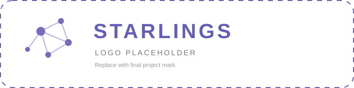

<div align="center">



# Starlings

**Operator-neutral coordination for controlled emergence.**

[](https://ziglang.org/)
[](#architecture)
[](#deterministic-runtime)
[](#research-status)

</div>

---

Starlings is a protocol and formal coordination substrate for studying **decentralized collective behavior across heterogeneous operators**.

The core is intentionally agnostic to operator implementation. A participant may be a deterministic algorithm, learned policy, language model, sensor, solver, robot, physics tool, human, or any other system that can consume a local observation and emit a typed coordination action.

The central research question is:

> Can useful global behavior emerge from local state, typed proposals, causal evidence, and runtime-enforced constraints without encoding the final workflow in a central controller?

The protocol core lives here. The application and stress experiments that validate it live in [`beaglabs/starling-experiments`](https://github.com/beaglabs/starling-experiments).

## Core capabilities

- **Operator-neutral population model** — no dependency on prompts, tokenizers, model providers, or chat APIs.
- **Typed coordination grammar** — `OBSERVE`, `QUERY`, `CLAIM`, `EVIDENCE`, `PROPOSE`, `ACCEPT`, `REJECT`, `CHALLENGE`, `RETRACT`, and `DELEGATE`.
- **Deterministic runtime** — seeded entropy, logical clocks, bounded queues, explicit routing failures, and replay-friendly traces.
- **Content-addressed provenance** — BLAKE3 identities, canonical encodings, causal parent closure, and Merkle-DAG replay.
- **Formal population substrate** — explicit population, topology, state, policy, transition, constraint, outcome, and cost abstractions.
- **Pluggable local policies** — deterministic rules, parameterized policies, learned models, solvers, or external adapters.
- **Protocol-constrained generation** — CFG machinery and provider-agnostic evaluation records for model-backed experiments.
- **Research-grade claim discipline** — formal theorems, validated invariants, empirical laws, conjectures, and demonstrations are kept distinct.

## Architecture

Starlings separates **operator behavior** from **coordination semantics**.

```text
                local observation
                       │
                       ▼
                 local policy πᵢ
                       │
                 typed proposal
                       │
                       ▼
                admissibility C
                  │         │
             accepted     rejected
                  │
                  ▼
            transition F
                  │
                  ▼
           local/global state
                  │
                  ▼
             observable Φ
```

The runtime owns admissibility, accounting, provenance, and replay. Operators own local decisions.

A global workflow may emerge from these local interactions, but it is not part of the core runtime API.

## Formal model

The canonical population is:

```text
P = (A, G, X, M, F, Π, C, Φ, J)
```

| Symbol | Meaning |
| --- | --- |
| `A` | operator population |
| `G` | communication / neighborhood graph |
| `X` | local state |
| `M` | typed coordination actions / messages |
| `F` | deterministic state-transition semantics |
| `Π` | local policy family |
| `C` | admissibility / control constraints |
| `Φ` | global observable / terminal evaluation |
| `J` | cost / measurement vector |

The operational model also makes explicit `Ω` (local observation), `α` (arbitration), and `H` (content identity).

**[Read Formal Starlings Model v0.1](docs/FORMAL_MODEL.md)**

The specification defines heterogeneous populations, local observation boundaries, typed proposals, synchronous/queue/event arbitration, global transition semantics, workflow emergence, deadlock, fault assumptions, theorem status, empirical laws, and the planned Byzantine robustness extension.

## Deterministic runtime

The core runtime uses bounded deterministic state transitions.

A message contains:

```text
sender
recipient
kind
payload
causal_ref
logical_clock
```

The runtime dequeues a message, resolves the recipient, advances logical time, appends the trace event, applies the local transition, and enqueues any emitted response.

Seeded entropy is exposed explicitly for experiments without hard-wiring one scheduler into the foundation.

## Content-addressed provenance

Starlings treats provenance as part of the protocol, not a logging afterthought.

Canonical causal events are encoded as:

```text
version:u8
|| event_kind:u8
|| payload:u64 little-endian
|| parent_count:u8
|| parent_content_ids[0..parent_count]
```

and identified by `BLAKE3(canonical_event_encoding)`.

The current implementation enforces deduplication, parent closure, reconstructable ancestry, explicit fork/merge history, and exact replica divergence accounting.

See:

- [`docs/adr/0001-content-addressed-provenance.md`](docs/adr/0001-content-addressed-provenance.md)
- [`docs/adr/0002-operator-neutral-coordination-core.md`](docs/adr/0002-operator-neutral-coordination-core.md)

## Research status

| Area | Status |
| --- | --- |
| Deterministic coordination runtime | Validated |
| Typed protocol grammar | Validated |
| Content-addressed provenance | Validated |
| Formal population substrate | Validated |
| Scaling and predictive coordination laws | Validated empirically |
| Fault / perturbation behavior | Validated empirically |
| Parameterized coordination policy | Validated |
| Local inference control | Validated empirically |
| Heterogeneous operator experiments | Validated empirically |
| Application-level workflow emergence | Validated in `starling-experiments` |
| Explicit formal model | **v0.1 defined** |
| Byzantine / rogue-operator robustness | Planned |

## Empirical evidence

The historical Stage 0–7C evidence is documented under [`docs/`](docs/).

The executable modern experiment suite is maintained separately in [`beaglabs/starling-experiments`](https://github.com/beaglabs/starling-experiments).

That repository contains deterministic contested fault matrices, asynchronous scaling, local inference-control experiments, heterogeneous operator trials, emergent specialist workflow formation, and state-dependent GEOINT operator activation.

This separation is deliberate:

```text
beaglabs/starlings
  protocol
  semantics
  formal model
  architectural decisions
  canonical theory

beaglabs/starling-experiments
  stress tests
  application witnesses
  generated datasets
  empirical falsification
```

## Existing empirical laws

The current evidence supports several compact relationships with explicitly limited claim scope.

### Sparse-load coordinate

```text
λ = F / (B H)
```

where `F` is information volume, `B` is local bandwidth, and `H` is the execution horizon.

This is a useful regime coordinate in tested sparse settings, not a universal threshold.

### Missing-information hazard

```text
h = -M log(1 - p^R)
P(reachable) ≈ exp(-h)
```

The hazard coordinate generalizes across held-out population, density, redundancy, severity, and compound perturbation cases, while the probability approximation underpredicts some rare high-hazard successes.

See [`docs/FORMAL_MODEL.md`](docs/FORMAL_MODEL.md) for the theorem/empirical-law distinction.

## Quick start

Requirements:

- Zig **0.16.0**
- macOS or Linux

Clone and run the full core test suite:

```bash
git clone https://github.com/beaglabs/starlings.git
cd starlings

zig version
zig test src/root.zig
```

The root suite covers deterministic runtime behavior, message routing, seeded entropy, provenance validation and stress, fork/merge causal closure, replica divergence, protocol traces and workflows, CFG parsing/stress, model-evaluation records, and formal-population behavior.

## Repository layout

```text
src/
  core/
    formal_population.zig    operator-neutral population substrate
    runtime.zig              deterministic message runtime
    operator.zig             local transition interface
    message.zig              typed coordination vocabulary
    content_id.zig           content-addressed identities

  protocol/
    protocol_cfg*.zig        grammar and constrained protocol machinery
    protocol_trace.zig       trace semantics
    protocol_workflow.zig    workflow structure
    protocol_model_*.zig     model-backed evaluation records

  provenance/
    provenance.zig           causal Merkle-DAG substrate
    provenance_validation.zig
    provenance_stress.zig

docs/
  FORMAL_MODEL.md            formal Starlings specification
  STAGES.md                  historical research program
  stage-*.md                 frozen experimental reports
  adr/                       architecture decisions

grammars/                    protocol grammars
trials/                      generated outputs; generally untracked
assets/                      project visual assets / logo placeholder
```

## Documentation

- **[Formal Starlings Model v0.1](docs/FORMAL_MODEL.md)** — mathematical object, transition semantics, emergence definition, theorem layer, empirical laws, and conjectures
- [`docs/STAGES.md`](docs/STAGES.md) — historical research progression
- [`docs/adr/0001-content-addressed-provenance.md`](docs/adr/0001-content-addressed-provenance.md) — provenance architecture
- [`docs/adr/0002-operator-neutral-coordination-core.md`](docs/adr/0002-operator-neutral-coordination-core.md) — operator-neutral core
- [`docs/adr/0003-state-aware-inference-controller.md`](docs/adr/0003-state-aware-inference-controller.md) — inference-control architecture
- [`docs/stage-5b-predictive-coordination-laws.md`](docs/stage-5b-predictive-coordination-laws.md) — predictive coordination laws
- [`docs/stage-6-1-robustness-law-validation.md`](docs/stage-6-1-robustness-law-validation.md) — robustness coordinate
- [`docs/stage-7a-parameterized-coordination-policy.md`](docs/stage-7a-parameterized-coordination-policy.md) — parameterized local policy

## Claim discipline

Starlings distinguishes five levels of result:

1. **Proven** — follows from explicit semantics under declared assumptions.
2. **Validated invariant** — checked across a frozen canonical experiment surface.
3. **Empirical law** — compact predictive relationship supported on declared holdouts.
4. **Conjecture** — mathematically stated but not yet proved or fully validated.
5. **Demonstration** — application-level witness of a formal phenomenon.

## Next research step

The immediate mathematical work is to replace the current abstract fairness assumption in finite-workflow progress with the actual arbitration semantics used by the emergence trials.

```text
dependency obligations
        ↓
local enablement
        ↓
semantic-blind arbitration
        ↓
finite progress theorem
        ↓
formal prediction
        ↓
Byzantine falsification trial
```

The objective is no longer to accumulate demos. It is to derive statements that the existing experiments can falsify.

---

<div align="center">

**Starlings** · local rules, causal evidence, global coordination

</div>
